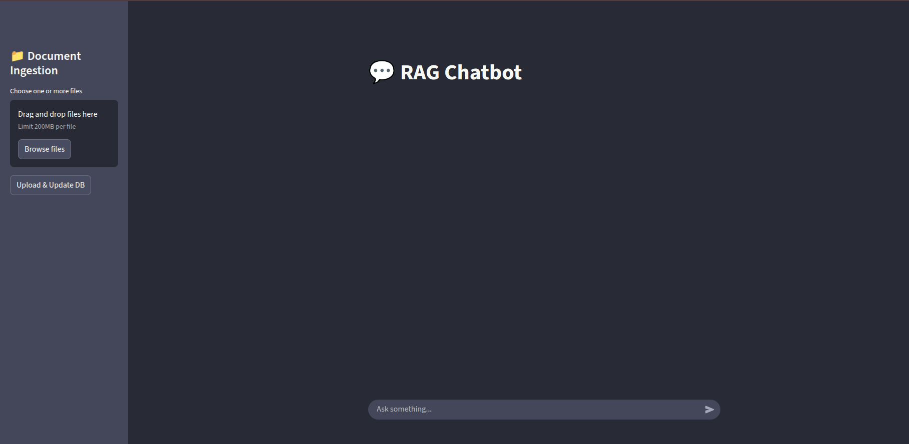

# RAG Chatbot

This is a RAG chatbot that uses LangChain and LangGraph to build a chatbot that can answer questions based on a given document.

## Setup

```bash
git clone sayedshaun/rag-chatbot
cd rag-chatbot
```
### Setup Environment Variables

```bash
GEMINI_API_KEY=YOUR_GEMINI_API_KEY
HUGGINGFACE_EMBEDDING_MODEL=all-MiniLM-L6-v2
BACKEND_PORT=8010
FRONTEND_PORT=9010

# If you use ollama model
OLLAMA_MODEL=llama3.2
```

## Start Server
```bash
docker compose up --build
```

## Overview



## Supported Document
- PDF
- Word
- TXT


## Supported Language
- English
