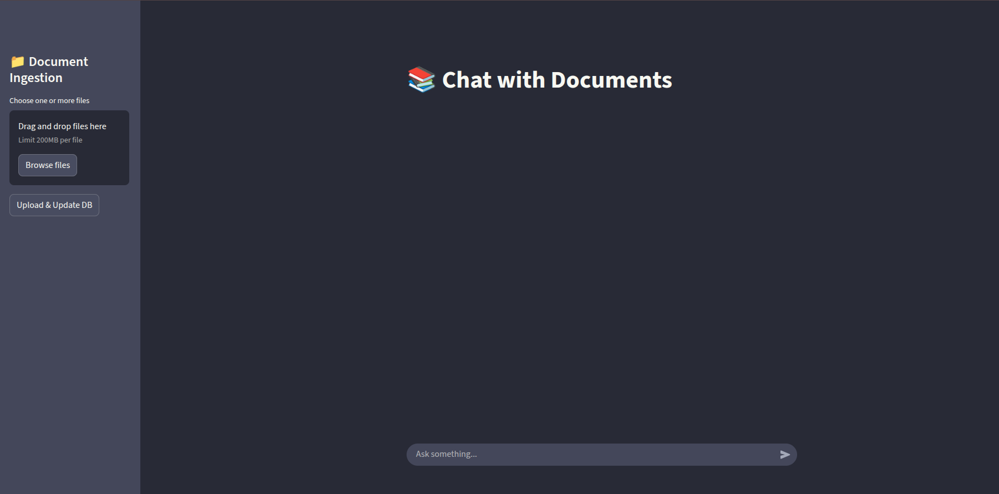

# ChatDocs: A private knowledge base chatbot to chat with your documents

This is a RAG chatbot that uses LangChain and LangGraph to build a chatbot that can answer questions based on a given document.

## Setup

```bash
git clone https://github.com/sayedshaun/chat-docs.git
cd chat-docs
```
### Setup Environment Variables

Create `.env` file and add the following environment variables:
```bash
GEMINI_API_KEY=YOUR_GEMINI_API_KEY
HUGGINGFACE_EMBEDDING_MODEL=all-MiniLM-L6-v2
BACKEND_PORT=8010
FRONTEND_PORT=9010

# Configuration
# Confgis
CHUNK_SIZE=500
CHUNK_OVERLAP=50

# If you use ollama model
OLLAMA_MODEL=llama3.2
```

If you use ollama model, you need to set up [ollama](https://ollama.com/download) first.

## Start Server
```bash
docker compose up --build
```

## Overview



## Supported Document
- PDF
- Word
- TXT


## Supported Language
Based on embedding model and document type. text pictures does not support yet but will be available soon.
